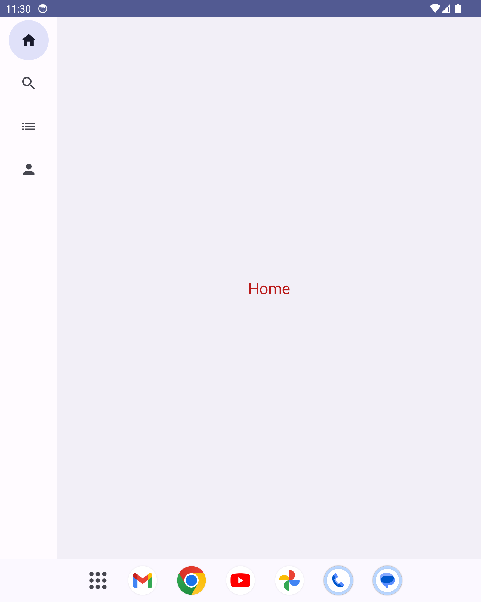

[](https://ktlint.github.io/)
[](https://developer.android.com/jetpack/compose)
[](https://kotlinlang.org/)
[](https://android-arsenal.com/api?level=21)
[](https://opensource.org/licenses/Apache-2.0)

<p align="center"> 
    
</p>

<h1 align="center"> Jetpack Compose Adaptive UI 

(Phones, Tablets & Folding Devices) </h1>


Adaptive UI Jetpack Compose is a demo open-source project that showcases how to create [adaptive designs](https://developer.android.com/jetpack/compose/layouts/adaptive) using [Jetpack Compose](https://www.googleadservices.com/pagead/aclk?sa=L&ai=DChcSEwirxJ-8nJGAAxWezMIEHZm2DusYABACGgJwdg&ohost=www.google.com&cid=CAESa-D2E9EHPMO24ZVeohcQzPgBKtfVfkbnufBlV2qUiGJ5XL1vhNoQ7Yyk9acePAcC0Xrx3KvcDy_b5pvHL3nlRFYBNebz9_mLYiGTkq45DFvSST2UrzbFYFcZWc4RNKcXC6Bs884F7_fCsX0t&sig=AOD64_1j28Y5zCwhCJe_uPcFZYyLdXxP9Q&q&adurl&ved=2ahUKEwjD8Zm8nJGAAxXPFzQIHcrGDR4Q0Qx6BAgKEAE&nis=8) for different screen sizes, including phones, tablets, and folding devices.

The project demonstrates best practices and techniques for building responsive user interfaces that adapt to various device form factors and postures. It covers topics such as window layout information tracking, handling folding features, and implementing different navigation patterns based on the device's capabilities.


## 🌳 Environment
Android Studio verison used : ``Android Studio Hedgehog | 2023.1.1 Canary 11``


## 🖼️ Demo Screens

|Phone Portrait<br>( Screen Size : Compact)<br>(< 600 dp)|Phone Landscape<br>( Screen Size : Medium)<br>(600 - 840 dp)|
|-|-|
| | |

|Tablet Portrait<br>( Screen Size : Medium)<br>(600 - 840 dp)|Tablet Landscape<br>( Screen Size : Expanded)<br>(> 840 dp) |
|-|-|
| | |

|Folding Device Closed<br>( Screen Size : Compact)<br>(< 600 dp)|Folding Device Opened<br>( Screen Size : Medium)<br>(600 - 840 dp) |
|-|-|
| | |

|Folding Device Portrait Closed<br>( Screen Size : Medium)<br>(600 - 840 dp)|Folding Device Portrait Opened<br>( Screen Size : Medium)<br>(600 - 840 dp) |
|-|-|
| | |

|Folding Device Landscape Closed<br>( Screen Size : Compact)<br>(< 600 dp)|Folding Device Landscape Opened<br>( Screen Size : Expanded)<br>(> 840 dp) |
|-|-|
| | |


## 💰 Bonus Knowledge

In this project, we have utilized [TOML (Tom's Obvious, Minimal Language)](https://developer.android.com/build/migrate-to-catalogs) as a configuration file format for managing `Gradle dependencies and plugins`. TOML provides a clean and easy-to-read syntax, making it simpler to manage and maintain the project's dependencies.

By using a TOML file, we can define and organize our Gradle dependencies and plugins in a structured manner. This approach enhances the `readability and maintainability` of our build configuration.

The TOML file in this project serves as a `centralized location` to specify the required dependencies and plugins, ensuring consistency across different build scripts. By utilizing TOML, we have streamlined the process of managing dependencies and plugins, making the project more efficient and easier to maintain.

Here is a basic example of what you can achieve with TOML:

## From

```
// Top-level `build.gradle.kts` file
plugins {
   id("com.android.application") version "7.4.1" apply false

}

// Module-level `build.gradle.kts` file
plugins {
   id("com.android.application")

}
dependencies {
    implementation("androidx.core:core-ktx:1.9.0")

}
```

## To
```
// Top-level build.gradle.kts
plugins {
   alias(libs.plugins.android.application) apply false

}

// module build.gradle.kts
plugins {
   alias(libs.plugins.android.application)

}
dependencies {
   implementation(libs.androidx.ktx)

}
```

## By adding code like this in libs.versions.toml
```
[versions]
ktx = "1.9.0"
androidGradlePlugin = "7.4.1"

[libraries]
androidx-ktx = { group = "androidx.core", name = "core-ktx", version.ref = "ktx" }

[plugins]
android-application = { id = "com.android.application", version.ref = "androidGradlePlugin" }

```

Feel free to explore the `TOML configuration file` in this project and adapt the approach to fit your own build management needs. You can find this file in project `gradle` folder with this name `libs.versions.toml`.


## 🤝 Contributing

Contributions are what make the open-source community such a fantastic place to learn, inspire,
and create. Any contributions you make are **greatly appreciated**.

**Note**: Please note that while this project focuses primarily on the use of ``Jetpack Compose``, it does not currently incorporate the use of ``foreground services`` for playing music in the background. This is an area where contributions would be precious, as foreground services are recommended for such functionality in Android development.

If you would like to contribute, please follow these steps:

1. Open an issue first to discuss what you would like to change.
2. Fork the Project
3. Create your feature branch (`git checkout -b feature/amazing-feature`)
4. Commit your changes (`git commit -m 'Add some amazing feature'`)
5. Push to the branch (`git push origin feature/amazing-feature`)
6. Open a pull request

Please make sure to update tests as appropriate.

## ✍️ Author


👤 **DawinderGill**

[](https://www.linkedin.com/in/dawinder-singh-gill-2b1833171)
[](https://play.google.com/store/apps/dev?id=6322881499451604311)
[](https://medium.com/@dawinderapps)

Feel free to ping me 😉


## 📝 License

```
Copyright © 2023 - DawinderGill
